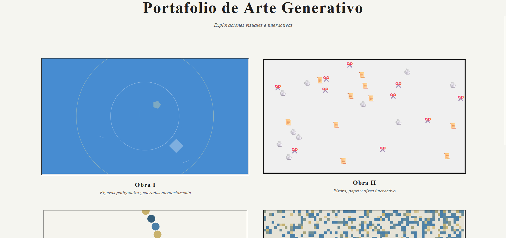

## LINKS
GitHub: https://github.com/dakotagh04/Portafolio/tree/main
Vercel: https://portafolio-tau-umber-48.vercel.app/

# Portafolio — Museo Digital

Este portafolio es un museo de arte digital con estética griega, usando dorados, beige y azul. La página principal es sencilla: tiene un título y cuatro previews interactivos de las obras, que permiten entrar y ver cada obra completa.

---

## 📌 Página principal

- **Descripción:**  
  La página principal muestra el título del museo y los previews de las cuatro obras. Cada preview es un pequeño fragmento interactivo que representa la obra de manera resumida. Al hacer clic en cualquiera de ellos, se accede a la obra completa.  

- **Captura:**  
    
  *(Reemplaza "ruta/a/la/imagen-principal.png" por la ruta de tu captura)*

---

## 🖼️ Obra 1 — Figuras poligonales aleatorias

- **Descripción:**  
  Genera figuras poligonales aleatorias y les asigna una ID. Cada ID genera siempre la misma composición, permitiendo reproducir la obra.  
  La obra experimenta con formas y aleatoriedad controlada.  

- **Captura:**  
  

---

## 🖼️ Obra 2 — Piedra, papel o tijera interactivo

- **Descripción:**  
  Se generan 50 piedras, 50 papeles y 50 tijeras que se mueven e interactúan entre sí.  
  Según la acción que el usuario elija (destrucción o conversión), los agentes interactúan destruyendo al perdedor o transformándolo en el ganador.  
  Esta obra explora simulaciones y dinámicas simples entre múltiples elementos.  

- **Captura:**  
  

---

## 🖼️ Obra 3 — Ball Attack / Serpiente de bolas

- **Descripción:**  
  Una fila de bolas desciende continuamente en diferentes colores.  
  La obra usa el micrófono: según el volumen del usuario, se sitúa en una franja de color y, si coincide con la bola correcta, esta se destruye.  
  Crea una sensación de movimiento continuo y permite experimentar con la interacción sonora y visual.  

- **Captura:**  
  

---

## 🖼️ Obra 4 — Juego de la vida de Conway

- **Descripción:**  
  Simulación del juego de la vida con opción de pausar y colocar/eliminar células manualmente.  
  Incluye un botón para generar células aleatorias y sliders para ajustar la velocidad y la densidad de generación.  
  Esta obra permite explorar dinámicas emergentes y control del usuario sobre simulaciones automáticas.  

- **Captura:**  
  

---

### 🔗 Nota
Todas las obras comparten una paleta coherente y estética inspirada en el arte griego. El conjunto forma un pequeño museo digital con interacción y movimiento.
